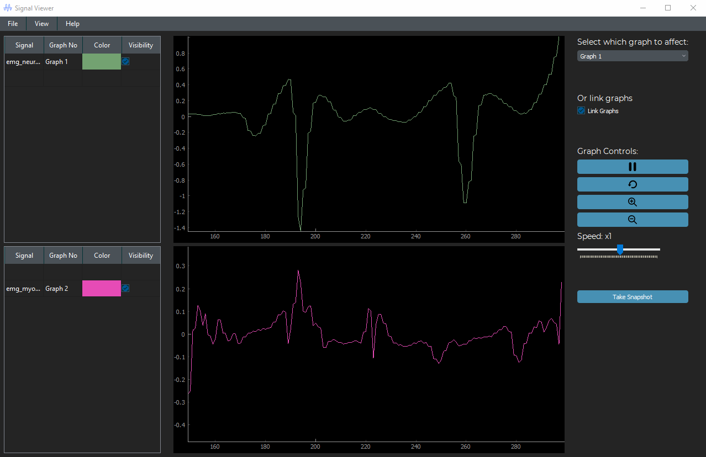
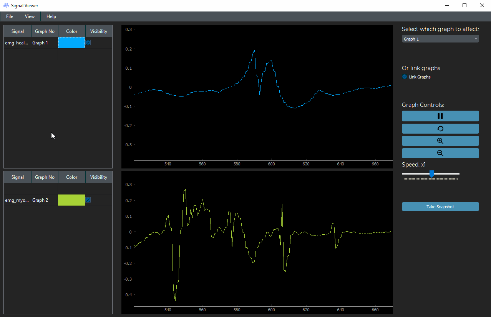

# Multi-Port, Multi-Channel Real-Time Monitoring

## Table of Contents:
- [Description](#description)
- [Project Features](#project-features)
- [Quick Preview](#quick-preview)
- [Executing program](#executing-program)
- [Help](#Help)
- [Contributors](#contributors)
- [License](#license)

## Description

The Multi-Port, Multi-Channel Signal Viewer is a desktop application developed in Python and Qt. The application is designed to assist in monitoring vital signals in an ICU setting. It allows users to open and visualize different medical signals, such as ECG, EMG, EEG, etc., in real-time. The user-friendly interface provides controls for manipulating signals, enabling an effective and interactive monitoring experience.

## Project Features

- **Multi-Port, Multi-Channel Viewer**: The application supports the simultaneous display of multiple signals in two independent graphs.
- **Graph Linking**: Users can link both graphs, ensuring synchronized time frames, signal speed, and viewport for seamless comparison.
- **Cine Mode**: Signals are displayed in cine mode, resembling real-time running signals as seen in ICU monitors.
- **Interactive Controls**:
  - Change signal color
  - Add labels/titles to signals
  - Show/hide signals
  - Control/customize cine speed
  - Zoom in/out
  - Pause/play/rewind
  - Scroll/Pan signals in any direction
  - Move signals between graphs

- **Boundary Conditions**: Intelligent handling of boundary conditions prevents unwanted manipulations outside signal limits.

- **Exporting & Reporting**: Users can generate reports with one or more snapshots of the graphs, including data statistics on displayed signals in a PDF format. Data statistics include mean, std, duration, min, and max values, organized in a well-structured table.

## Quick Preview

#### Controlling Graphs in Linked Mode



#### Change Signal Colors



## Executing program

To be able to use our app, you can simply follow these steps:
1. Install Python3 on your device. You can download it from <a href="https://www.python.org/downloads/">Here</a>.
2. Install the required packages by the following command.
```
pip install -r requirements.txt
```
3. Run the file with the name "filterDesignUI.py"

## Help

If you encounter any issues or have questions, feel free to reach out.

## Contributors

Gratitude goes out to all team members for their valuable contributions to this project.

<div align="left">
  <a href="https://github.com/cln-Kafka">
    
  </a>
  <a href="https://github.com/1MuhammadSami1">
    
  </a>
  <a href="https://github.com/MohamedSayedDiab">
    
  </a>
</div>

## License

All rights reserved © 2023 to Team 19 - Systems & Biomedical Engineering, Cairo University (Class 2025)
